# FluxaPay Complete Flow

> End-to-End Flow: From Merchant Signup to Settlement

## Table of Contents
- [Phase 1: Merchant Onboarding](#phase-1-merchant-onboarding)
- [Phase 2: Customer Makes Purchase](#phase-2-customer-makes-purchase)
- [Phase 3: FluxaPay Processes Payment Request](#phase-3-fluxapay-processes-payment-request)
- [Phase 4: Customer Completes Payment](#phase-4-customer-completes-payment)
- [Phase 5: FluxaPay Detects & Verifies Payment](#phase-5-fluxapay-detects--verifies-payment)
- [Phase 6: Notify Merchant](#phase-6-notify-merchant)
- [Phase 7: Fund Sweeping](#phase-7-fund-sweeping)
- [Phase 8: Settlement to Merchant](#phase-8-settlement-to-merchant)
- [Complete Flow Summary](#complete-flow-summary)

---

## Phase 1: Merchant Onboarding

### Step 1: Merchant Signs Up

1. Merchant visits `fluxapay.com/signup`

2. Fills registration form:
   - **Business name:** "Cool Shop"
   - **Email:** merchant@coolshop.com
   - **Country:** Nigeria
   - **Settlement currency:** NGN
   - **Bank details:** (for fiat settlements)

3. Submits form → FluxaPay Backend

### Step 2: FluxaPay Creates Merchant Account

**Backend Process:**

1. Generate unique `merchant_id`: `"merch_abc123"`

2. Store merchant profile in database:

```json
{
  "merchant_id": "merch_abc123",
  "business_name": "Cool Shop",
  "email": "merchant@coolshop.com",
  "country": "NG",
  "settlement_currency": "NGN",
  "bank_account": {...},
  "api_key": "sk_live_xyz789",
  "webhook_url": null,
  "status": "active",
  "created_at": "timestamp"
}
```

3. Register merchant in Merchant Registry Contract (Stellar):

```javascript
register_merchant(
  merchant_id: "merch_abc123",
  business_name: "Cool Shop",
  settlement_currency: "NGN"
)
```

4. Send welcome email with:
   - API credentials
   - Dashboard login
   - Integration docs

### Step 3: Merchant Completes Setup

**Merchant Dashboard:**

1. Logs into `dashboard.fluxapay.com`

2. Configures settings:
   - Sets webhook URL: `https://coolshop.com/webhooks/fluxapay`
   - Generates API keys
   - Reviews settlement schedule (daily/weekly)

3. Integrates FluxaPay into their website
   - Adds payment button
   - Implements API calls

---

## Phase 2: Customer Makes Purchase

### Step 4: Customer Shops on Merchant's Website

**Customer Journey:**

1. Customer (Alice) browses `coolshop.com`

2. Adds items to cart:
   - Wireless Headphones: $45
   - Phone Case: $5
   - **Total: $50**

3. Proceeds to checkout

4. Selects payment method:
   - ○ Credit Card
   - ○ Bank Transfer
   - ● Pay with Crypto (USDC) ✓

5. Clicks **"Pay with Crypto"**

### Step 5: Merchant Backend Creates Payment

**Cool Shop Backend API Call:**

```http
POST https://api.fluxapay.com/v1/payments
Authorization: Bearer sk_live_xyz789
Content-Type: application/json
```

```json
{
  "amount": 50,
  "currency": "USDC",
  "customer_email": "alice@email.com",
  "order_id": "order_12345",
  "metadata": {
    "customer_name": "Alice",
    "items": ["Headphones", "Phone Case"]
  },
  "success_url": "https://coolshop.com/order/success",
  "cancel_url": "https://coolshop.com/cart"
}
```

---

## Phase 3: FluxaPay Processes Payment Request

### Step 6: FluxaPay Generates Unique Payment Address

**FluxaPay Backend Process:**

1. Receive payment creation request

2. Generate unique `payment_id`: `"pay_xyz789"`

3. **Derive unique Stellar address using HD Wallet:**

   ```
   HD Wallet Derivation:
   - Master Seed: [SECURED_MASTER_SEED]
   - Derivation path: master_seed → merch_abc123 → pay_xyz789
   - Generated Keypair:
     * Public Key (address): GPAY_XYZ789...AAA
     * Secret Key: SPAY_SECRET...BBB (stored encrypted)
   ```

4. **Create Stellar account for this payment:**
   - Check if `GPAY_XYZ789...AAA` exists on Stellar
   - If not, create account:
     - Send 0.5 XLM from FluxaPay's funding account
     - Establish trustline for USDC

5. **Store payment in Payment Contract (Stellar):**

```javascript
create_payment(
  payment_id: "pay_xyz789",
  merchant_id: "merch_abc123",
  amount: 50,
  currency: "USDC",
  deposit_address: "GPAY_XYZ789...AAA",
  status: "pending",
  customer_email: "alice@email.com",
  order_id: "order_12345",
  metadata: {...},
  expires_at: now + 30 minutes
)
```

6. **Store in PostgreSQL database:**

```sql
INSERT INTO payments (
  payment_id, merchant_id, amount, currency,
  deposit_address, status, created_at, expires_at
) VALUES (
  'pay_xyz789', 'merch_abc123', 50, 'USDC',
  'GPAY_XYZ789...AAA', 'pending', NOW(), NOW() + INTERVAL '30 minutes'
)
```

7. **Emit webhook: `payment.created`**

```http
POST https://coolshop.com/webhooks/fluxapay
```

```json
{
  "event": "payment.created",
  "payment_id": "pay_xyz789",
  "status": "pending",
  "amount": 50,
  "currency": "USDC"
}
```

8. **Return response to Cool Shop:**

```json
{
  "payment_id": "pay_xyz789",
  "deposit_address": "GPAY_XYZ789...AAA",
  "amount": 50,
  "currency": "USDC",
  "status": "pending",
  "expires_at": "2026-01-20T15:30:00Z",
  "checkout_url": "https://pay.fluxapay.com/pay_xyz789"
}
```

### Step 7: Merchant Redirects Customer to FluxaPay Checkout

**Cool Shop Backend:**

1. Receives FluxaPay response

2. Redirects Alice to: `https://pay.fluxapay.com/pay_xyz789`

   **OR** embeds FluxaPay checkout widget on their page

---

## Phase 4: Customer Completes Payment

### Step 8: Customer Sees Payment Page

**FluxaPay Checkout Page** (`pay.fluxapay.com/pay_xyz789`):

```
┌──────────────────────────────────────────────────┐
│  🔒 Secure Payment - FluxaPay                    │
├──────────────────────────────────────────────────┤
│                                                  │
│  Pay Cool Shop                                   │
│  Order #12345                                    │
│                                                  │
│  Amount: 50 USDC                                 │
│                                                  │
│  ┌────────────────────────────────────────────┐ │
│  │ Send USDC on Stellar Network to:          │ │
│  │                                            │ │
│  │  GPAY_XYZ789...AAA                         │ │
│  │  [Copy Address] [Show QR Code]             │ │
│  └────────────────────────────────────────────┘ │
│                                                  │
│  ⏱️ Payment expires in: 28:45                   │
│                                                  │
│  💡 How to pay:                                 │
│  1. Open your Stellar wallet (Lobstr, etc.)     │
│  2. Send exactly 50 USDC to the address above   │
│  3. Wait for confirmation                       │
│                                                  │
│  Status: ⏳ Waiting for payment...              │
│  [Checking blockchain...]                       │
│                                                  │
└──────────────────────────────────────────────────┘
```

> Page auto-refreshes every 5 seconds to check payment status

### Step 9: Customer Sends Payment

**Alice's Actions:**

1. Opens Stellar wallet app (e.g., Lobstr)

2. Clicks "Send"

3. Enters:
   - **Recipient:** `GPAY_XYZ789...AAA` (copies from FluxaPay page)
   - **Amount:** 50 USDC
   - **Asset:** USDC

4. Reviews transaction

5. Confirms and signs transaction

6. Transaction submitted to Stellar network
   - **Transaction Hash:** `TXN_HASH_ABC123...`

7. Stellar network processes (3-5 seconds)

8. ✅ Transaction confirmed on blockchain

---

## Phase 5: FluxaPay Detects & Verifies Payment

### Step 10: Oracle Monitors & Detects Payment

**FluxaPay Oracle Service** (runs continuously):

**Every 3 seconds:**

1. Query database for active pending payments:

```sql
SELECT * FROM payments 
WHERE status = 'pending' 
AND expires_at > NOW()
```

Results: `[..., pay_xyz789, ...]`

2. For each pending payment, check Stellar blockchain:

```http
GET https://horizon.stellar.org/accounts/GPAY_XYZ789...AAA/transactions
```

3. **Oracle sees new transaction:**

```json
{
  "hash": "TXN_HASH_ABC123...",
  "source_account": "GALICE_WALLET...XYZ",
  "created_at": "2026-01-20T15:05:30Z",
  "operations": [
    {
      "type": "payment",
      "from": "GALICE_WALLET...XYZ",
      "to": "GPAY_XYZ789...AAA",
      "asset_code": "USDC",
      "amount": "50.0000000"
    }
  ]
}
```

4. **Oracle validates:**
   - ✓ Destination address matches
   - ✓ Asset is USDC
   - ✓ Amount matches expected (50 USDC)
   - ✓ Payment hasn't expired
   - ✓ Payment status is still "pending"
   - ✓ Transaction hash not already processed

5. ✅ **Validation successful** → Proceed to verification

### Step 11: Oracle Calls Smart Contract for Verification

**Oracle → Payment Contract (Stellar):**

```javascript
verify_payment(
  payment_id: "pay_xyz789",
  transaction_hash: "TXN_HASH_ABC123...",
  payer_address: "GALICE_WALLET...XYZ",
  amount_received: 50
)
```

**Smart Contract Execution:**

1. Load payment data from contract state:
   ```javascript
   payment = get_payment("pay_xyz789")
   ```

2. **Verify conditions:**
   - `payment.status == "pending"` ✓
   - `payment.amount == 50` ✓
   - `transaction_hash not in processed_transactions` ✓
   - `payment.expires_at > current_time` ✓

3. **Update payment state:**
   ```javascript
   payment.status = "confirmed"
   payment.confirmed_at = current_timestamp
   payment.transaction_hash = "TXN_HASH_ABC123..."
   payment.payer_address = "GALICE_WALLET...XYZ"
   ```

4. **Add transaction to processed list:**
   ```javascript
   processed_transactions.push("TXN_HASH_ABC123...")
   ```

5. Save to contract storage

6. **Emit event:**
   ```javascript
   PaymentConfirmed {
     payment_id: "pay_xyz789",
     merchant_id: "merch_abc123",
     amount: 50,
     transaction_hash: "TXN_HASH_ABC123..."
   }
   ```

7. Return success to Oracle

### Step 12: Update Database

**Oracle → PostgreSQL:**

```sql
UPDATE payments 
SET 
  status = 'confirmed',
  confirmed_at = NOW(),
  transaction_hash = 'TXN_HASH_ABC123...',
  payer_address = 'GALICE_WALLET...XYZ'
WHERE payment_id = 'pay_xyz789'
```

---

## Phase 6: Notify Merchant

### Step 13: Send Webhook to Merchant

**FluxaPay Webhook Service:**

1. Listens for `PaymentConfirmed` event from contract

2. Event received for `payment_id`: `"pay_xyz789"`

3. Fetch full payment details from database

4. **Construct webhook payload:**

```json
{
  "event": "payment.confirmed",
  "payment_id": "pay_xyz789",
  "merchant_id": "merch_abc123",
  "order_id": "order_12345",
  "amount": 50,
  "currency": "USDC",
  "status": "confirmed",
  "transaction_hash": "TXN_HASH_ABC123...",
  "payer_address": "GALICE_WALLET...XYZ",
  "confirmed_at": "2026-01-20T15:05:35Z",
  "metadata": {
    "customer_name": "Alice",
    "items": ["Headphones", "Phone Case"]
  }
}
```

5. **Sign payload with merchant's webhook secret.**
   Compute an HMAC-SHA256 over the ISO timestamp and the JSON body joined
   by a dot (`${timestamp}.${payload}`) and use the merchant's
   `webhook_secret` as the HMAC key.  Include the timestamp in a header so
   receivers can enforce a freshness window and detect replay attacks.

6. **Send webhook:**

```http
POST https://coolshop.com/webhooks/fluxapay
X-FluxaPay-Signature: [HMAC_SIGNATURE]
X-FluxaPay-Timestamp: 2026-02-26T12:00:00.000Z
```
7. **Retry logic:**
   - If fails, retry with exponential backoff
   - Attempt 1: immediate
   - Attempt 2: after 5 seconds
   - Attempt 3: after 25 seconds
   - Attempt 4: after 2 minutes
   - Max 5 attempts

8. Log webhook delivery status

### Step 14: Merchant Processes Order

**Cool Shop Backend** (webhook handler):

1. Receives webhook at `/webhooks/fluxapay`

2. **Validates signature:**
   - Verify `X-FluxaPay-Signature` header
   - Prevents spoofing

3. **Validates event:**

```javascript
if (payload.event === 'payment.confirmed' && 
    payload.payment_id === 'pay_xyz789') {
  
  // Find order in database
  order = db.orders.find({ id: 'order_12345' })
  
  // Update order status
  order.status = 'paid'
  order.payment_confirmed_at = payload.confirmed_at
  order.save()
  
  // Trigger fulfillment
  fulfillmentService.processOrder(order)
  
  // Send confirmation email to customer
  emailService.send({
    to: 'alice@email.com',
    subject: 'Order Confirmed!',
    body: 'Your payment was successful...'
  })
}
```

4. Return `200 OK` to FluxaPay (acknowledge webhook)

### Step 15: Update Customer on Payment Page

**FluxaPay Checkout Page** (WebSocket/polling update):

```
┌──────────────────────────────────────────────────┐
│  🔒 Secure Payment - FluxaPay                    │
├──────────────────────────────────────────────────┤
│                                                  │
│  ✅ Payment Confirmed!                           │
│                                                  │
│  Amount: 50 USDC                                 │
│  Transaction: TXN_HASH_ABC123...                 │
│  Confirmed at: 2026-01-20 15:05:35 UTC          │
│                                                  │
│  Redirecting to Cool Shop...                     │
│                                                  │
└──────────────────────────────────────────────────┘
```

Auto-redirect to: `https://coolshop.com/order/success?payment_id=pay_xyz789`

Customer sees order confirmation on Cool Shop ✅

---

## Phase 7: Fund Sweeping

### Step 16: Auto-Sweep USDC to FluxaPay Treasury

**FluxaPay Sweep Service** (runs every 5 minutes):

1. Query database for confirmed but unswept payments:

```sql
SELECT * FROM payments 
WHERE status = 'confirmed' 
AND swept = false
```

Results: `[pay_xyz789, pay_abc456, ...]`

2. **For each payment to sweep:**

   **Payment:** `pay_xyz789`
   
   a) Retrieve encrypted secret key from database
   
   b) Decrypt secret key:
   ```javascript
   secret_key = decrypt(encrypted_key)
   keypair = Keypair.fromSecret(secret_key)
   // Result: keypair for GPAY_XYZ789...AAA
   ```

   c) Build sweep transaction:
   ```javascript
   transaction = new TransactionBuilder(account, {
     fee: BASE_FEE,
     networkPassphrase: Networks.PUBLIC
   })
   .addOperation(Operation.payment({
     destination: 'GFLUXAPAY_TREASURY...XYZ',  // FluxaPay main wallet
     asset: new Asset('USDC', USDC_ISSUER),
     amount: '50.0000000'
   }))
   .addMemo(Memo.text('pay_xyz789'))  // Track which payment
   .setTimeout(30)
   .build()
   ```

   d) Sign transaction:
   ```javascript
   transaction.sign(keypair)
   ```

   e) Submit to Stellar network:
   ```javascript
   response = await horizon.submitTransaction(transaction)
   ```
   **Sweep Transaction Hash:** `SWEEP_TXN_ABC...`

   f) Update database:
   ```sql
   UPDATE payments 
   SET 
     swept = true,
     swept_at = NOW(),
     sweep_transaction_hash = 'SWEEP_TXN_ABC...'
   WHERE payment_id = 'pay_xyz789'
   ```

   g) (Optional) Merge payment account to reclaim XLM:
      - Reduces ongoing costs
      - Sends remaining XLM back to funding account

3. Repeat for all confirmed payments

4. **FluxaPay Treasury now holds:**
   - Previous balance + 50 USDC from `pay_xyz789`
   - Accumulates USDC from all merchants

---

## Phase 8: Settlement to Merchant

### Step 17: Batch Settlement Processing (Daily/Weekly)

**FluxaPay Settlement Service** (runs daily at 00:00 UTC):

1. **Calculate settlements per merchant:**

```sql
SELECT merchant_id, SUM(amount) as total_usdc
FROM payments
WHERE status = 'confirmed'
AND swept = true
AND settled = false
GROUP BY merchant_id
```

**Results:**
- `merch_abc123` (Cool Shop): 450 USDC (9 payments)
- `merch_def456` (Tech Store): 1200 USDC (15 payments)
- ...

2. **For each merchant settlement:**

   **Merchant:** `merch_abc123` (Cool Shop)  
   **Total USDC:** 450  
   **Settlement Currency:** NGN
   
   a) Fetch merchant details:
   ```javascript
   merchant = db.merchants.find('merch_abc123')
   bank_account = merchant.bank_account
   settlement_currency = merchant.settlement_currency  // NGN
   ```

   b) **Convert USDC to NGN:**
   - Current rate: 1 USDC = 1,500 NGN
   - 450 USDC × 1,500 = 675,000 NGN
   - Minus FluxaPay fee (2%): 675,000 - 13,500 = **661,500 NGN**

   c) **Process bank transfer:**
   - Use payment partner (Paystack, Flutterwave, etc.)
   - Transfer 661,500 NGN to merchant's bank account
   - **Transfer Reference:** `SETTLE_XYZ123`

   d) **Update Settlement Coordinator Contract:**
   ```javascript
   mark_settled(
     merchant_id: "merch_abc123",
     payment_ids: [pay_xyz789, pay_abc456, ...],
     usdc_amount: 450,
     fiat_currency: "NGN",
     fiat_amount: 661500,
     settlement_reference: "SETTLE_XYZ123"
   )
   ```

   e) **Update database:**
   ```sql
   UPDATE payments 
   SET 
     settled = true,
     settled_at = NOW(),
     settlement_reference = 'SETTLE_XYZ123',
     settlement_fiat_amount = 661500,
     settlement_fiat_currency = 'NGN'
   WHERE payment_id IN (pay_xyz789, pay_abc456, ...)
   ```

   f) **Send webhook to merchant:**
   ```json
   {
     "event": "settlement.completed",
     "merchant_id": "merch_abc123",
     "payment_ids": ["pay_xyz789", "pay_abc456", ...],
     "total_payments": 9,
     "usdc_amount": 450,
     "settlement_currency": "NGN",
     "settlement_amount": 661500,
     "settlement_fee": 13500,
     "bank_reference": "SETTLE_XYZ123",
     "settled_at": "2026-01-21T00:15:00Z"
   }
   ```

   g) Send settlement notification email to merchant

### Step 18: Merchant Receives Settlement

**Cool Shop:**

1. Receives webhook: `settlement.completed`

2. Updates accounting system:
   - Record revenue: 661,500 NGN
   - Record FluxaPay fees: 13,500 NGN

3. Receives bank transfer:
   - Bank account credited: **661,500 NGN**
   - Reference: `SETTLE_XYZ123`

4. Can view details in FluxaPay dashboard:
   - Transaction history
   - Settlement reports
   - Download invoices

---

## Complete Flow Summary

```mermaid
graph TD
    A[1. MERCHANT ONBOARDING<br/>Merchant signs up → Get API keys → Integrate] --> B
    B[2. CUSTOMER CHECKOUT<br/>Customer adds to cart → Clicks Pay with Crypto] --> C
    C[3. PAYMENT CREATION<br/>Merchant API call → FluxaPay generates unique<br/>payment address HD wallet → Returns checkout URL] --> D
    D[4. CUSTOMER PAYS<br/>Customer sees payment page → Sends USDC from wallet<br/>to unique address → Transaction on Stellar] --> E
    E[5. DETECTION & VERIFICATION<br/>Oracle monitors address → Detects payment →<br/>Verifies on smart contract → Updates status] --> F
    F[6. MERCHANT NOTIFICATION<br/>Webhook sent to merchant → Merchant fulfills order<br/>→ Customer receives confirmation] --> G
    G[7. FUND SWEEPING<br/>Auto-sweep USDC from payment address → FluxaPay<br/>treasury → Accumulate funds] --> H
    H[8. SETTLEMENT<br/>Batch payments by merchant → Convert USDC to fiat →<br/>Bank transfer to merchant → Settlement complete]
```



### Visual Flow Diagram

```
┌─────────────────────────────────────────────────────────┐
│ 1. MERCHANT ONBOARDING                                  │
│    Merchant signs up → Get API keys → Integrate         │
└─────────────────────────────────────────────────────────┘
                         ↓
┌─────────────────────────────────────────────────────────┐
│ 2. CUSTOMER CHECKOUT                                    │
│    Customer adds to cart → Clicks "Pay with Crypto"     │
└─────────────────────────────────────────────────────────┘
                         ↓
┌─────────────────────────────────────────────────────────┐
│ 3. PAYMENT CREATION                                     │
│    Merchant API call → FluxaPay generates unique        │
│    payment address (HD wallet) → Returns checkout URL   │
└─────────────────────────────────────────────────────────┘
                         ↓
┌─────────────────────────────────────────────────────────┐
│ 4. CUSTOMER PAYS                                        │
│    Customer sees payment page → Sends USDC from wallet  │
│    to unique address → Transaction on Stellar           │
└─────────────────────────────────────────────────────────┘
                         ↓
┌─────────────────────────────────────────────────────────┐
│ 5. DETECTION & VERIFICATION                             │
│    Oracle monitors address → Detects payment →          │
│    Verifies on smart contract → Updates status          │
└─────────────────────────────────────────────────────────┘
                         ↓
┌─────────────────────────────────────────────────────────┐
│ 6. MERCHANT NOTIFICATION                                │
│    Webhook sent to merchant → Merchant fulfills order   │
│    → Customer receives confirmation                     │
└─────────────────────────────────────────────────────────┘
                         ↓
┌─────────────────────────────────────────────────────────┐
│ 7. FUND SWEEPING                                        │
│    Auto-sweep USDC from payment address → FluxaPay      │
│    treasury → Accumulate funds                          │
└─────────────────────────────────────────────────────────┘
                         ↓
┌─────────────────────────────────────────────────────────┐
│ 8. SETTLEMENT                                           │
│    Batch payments by merchant → Convert USDC to fiat →  │
│    Bank transfer to merchant → Settlement complete      │
└─────────────────────────────────────────────────────────┘
```

---

## Key Addresses & Wallets

### FluxaPay System:

```
FluxaPay System:
├── Master Seed: [HIGHLY SECURED]
│   └── Used to derive all payment addresses
│
├── Treasury Wallet: GFLUXAPAY_TREASURY...XYZ
│   └── Receives swept USDC from all payments
│
├── Funding Wallet: GFLUXAPAY_FUNDING...ABC
│   └── Funds new payment addresses with XLM
│
└── Per-Payment Addresses (derived):
    ├── GPAY_XYZ789...AAA (for pay_xyz789)
    ├── GPAY_ABC456...BBB (for pay_abc456)
    └── ... (one per payment, deterministically derived)
```

### Merchant:

```
Merchant:
└── Cool Shop (merch_abc123)
    └── No Stellar address needed
        └── Receives NGN in bank account
```

---

## Key Features

- ✅ **Unique address per payment** - No payment ambiguity
- ✅ **Automated detection** - Oracle monitors blockchain
- ✅ **Smart contract verification** - On-chain proof
- ✅ **Instant notifications** - Real-time webhooks
- ✅ **Automatic sweeping** - Secure fund management
- ✅ **Batch settlements** - Cost-efficient fiat conversion
- ✅ **Multi-currency support** - Settle in local currencies

---

**This is the complete end-to-end flow!** Each payment gets its own unique address, no ambiguity, and fully automated settlement. 🚀
